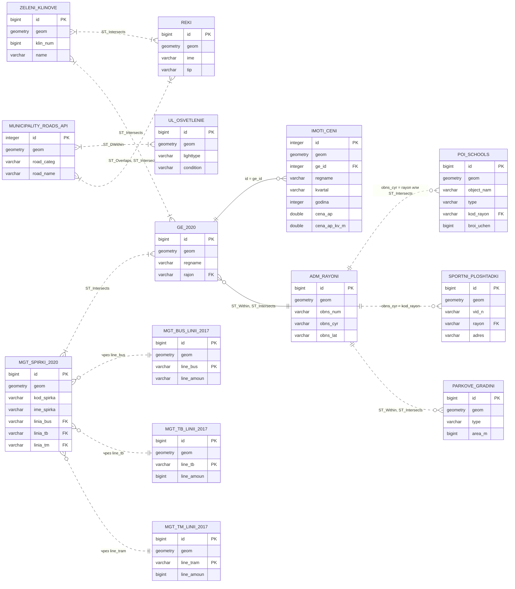

```mermaid


erDiagram
    direction LR
    %% Административно деление
    ADM_RAYONI {
        bigint id PK
        geometry geom
        varchar obns_num
        varchar obns_cyr
        varchar obns_lat
    }
    
    GE_2020 {
        bigint id PK
        geometry geom
        varchar regname
        varchar rajon FK
    }
    
    %% Инфраструктура
    MUNICIPALITY_ROADS_API {
        integer id PK
        geometry geom
        varchar road_categ
        varchar road_name
    }
    
    UL_OSVETLENIE {
        bigint id PK
        geometry geom
        varchar lighttype
        varchar condition
    }
    
    REKI {
        bigint id PK
        geometry geom
        varchar ime
        varchar tip
    }
    
    %% Обекти
    POI_SCHOOLS {
        bigint id PK
        geometry geom
        varchar object_nam
        varchar type
        varchar kod_rayon FK
        bigint broi_uchen
    }
    
    PARKOVE_GRADINI {
        bigint id PK
        geometry geom
        varchar type
        bigint area_m
    }
    
    ZELENI_KLINOVE {
        bigint id PK
        geometry geom
        bigint klin_num
        varchar name
    }
    
    SPORTNI_PLOSHTADKI {
        bigint id PK
        geometry geom
        varchar vid_n
        varchar rayon FK
        varchar adres
    }
    
    %% Градски транспорт
    MGT_SPIRKI_2020 {
        bigint id PK
        geometry geom
        varchar kod_spirka
        varchar ime_spirka
        varchar linia_bus FK
        varchar linia_tb FK
        varchar linia_tm FK
    }
    
    MGT_BUS_LINII_2017 {
        bigint id PK
        geometry geom
        varchar line_bus PK
        varchar line_amoun
    }
    
    MGT_TB_LINII_2017 {
        bigint id PK
        geometry geom
        varchar line_tb PK
        bigint line_amoun
    }
    
    MGT_TM_LINII_2017 {
        bigint id PK
        geometry geom
        varchar line_tram PK
        bigint line_amoun
    }
    
    %% Имотни данни
    IMOTI_CENI {
        integer id PK
        geometry geom
        integer ge_id FK
        varchar regname
        varchar kvartal
        integer godina
        double cena_ap
        double cena_ap_kv_m
    }
    
    %% Връзки
    
    %% Съществуващи връзки (идентифициращи)
    GE_2020 ||--o{ IMOTI_CENI : "id = ge_id"
    GE_2020 }o--|| ADM_RAYONI : "ST_Within, ST_Intersects"

    %% Пространствени връзки (неидентифициращи)
    ADM_RAYONI ||..o{ POI_SCHOOLS : "obns_cyr = rayon или ST_Intersects"
    ADM_RAYONI ||..o{ SPORTNI_PLOSHTADKI : "obns_cyr = kod_rayon"
    ADM_RAYONI ||..o{ PARKOVE_GRADINI : "ST_Within, ST_Intersects"
    
    MUNICIPALITY_ROADS_API }|..|{ UL_OSVETLENIE : "ST_DWithin"
    MUNICIPALITY_ROADS_API }|..|{ REKI : "ST_Overlaps, ST_Intersects"
    ZELENI_KLINOVE }|..|{ REKI : "ST_Intersects"
    ZELENI_KLINOVE }|..|{ GE_2020: "ST_Intersects"
    
    MGT_SPIRKI_2020 }|..|{ GE_2020: "ST_Intersects"
    MGT_SPIRKI_2020 }o..|| MGT_BUS_LINII_2017 : "чрез line_bus"
    MGT_SPIRKI_2020 }o..|| MGT_TB_LINII_2017 : "чрез line_tb"
    MGT_SPIRKI_2020 }o..|| MGT_TM_LINII_2017 : "чрез line_tram"

```